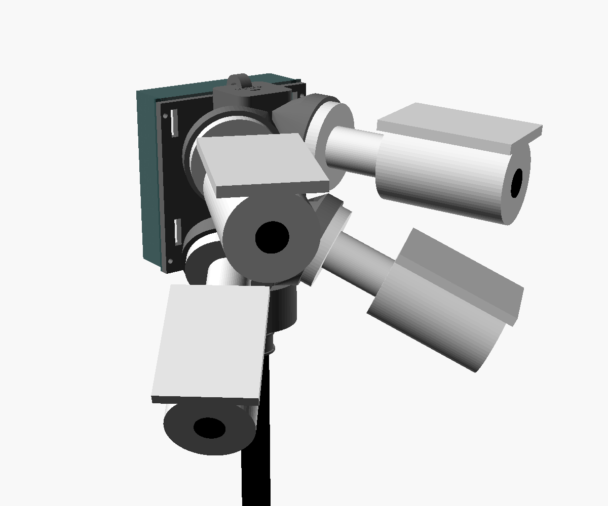
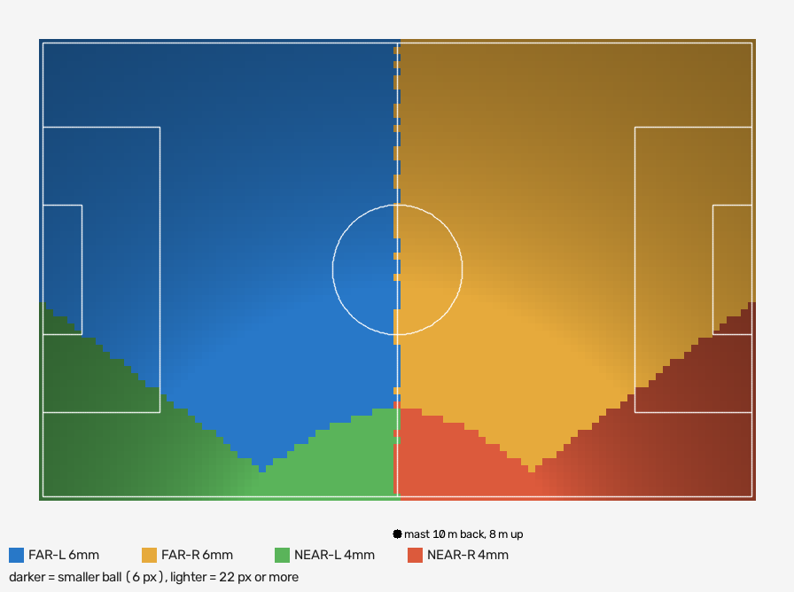

# The sideline rig

Four fixed 4K cameras on one 8 m mast at the halfway line: the static camera
the spec's Mode A is built for (M9, pulled forward by `docs/NEXT.md`). One
mast, one head, one cable up the mast, set up by one person in about fifteen
minutes. Everything here is sized by arithmetic until footage from it says
otherwise; the first match on it is a measurement, not a result.



## What it sees

`rig_geometry.py` projects every metre of the pitch through the four cameras
(datasheet lenses, an f-theta lens model) from an 8 m mast 10 m behind the
touchline:

| | 11v11 (100 x 64 m) | 9v9 (69 x 46 m) | 7v7 (55 x 37 m) |
| --- | --- | --- | --- |
| smallest ball anywhere | 8.6 px | 11.6 px | 14.3 px |
| ball at the far corner | 9.8 px | 12.4 px | 14.9 px |
| smallest player | 62 px | 75 px | 92 px |
| worst foot position | 0.25 m per px | 0.14 | 0.09 |

The same head keeps the whole pitch in frame, including the heads of players
on the far touchline and a 2 m margin outside the lines, in these positions:

- a 6-7 m mast 8-12 m behind the touchline;
- an 8 m mast 10-12 m behind.

Closer in, a sliver of that margin nearest the mast drops out (99-99.9%).
With every camera aimed up to 2 degrees off, nothing inside the lines
drops out in 300 random trials; at worst 0.01% of the margin does.

Why this shape, in three lines:

- **Halfway, sideline.** It is the one spot that minimises the farthest
  distance to any point on the pitch: 86-90 m on 11v11, against 110 m behind a
  goal and 126 m from a corner. Behind a goal also looks down the length of the
  pitch, the axis thirds, zones, shot locations and the defensive line are
  measured along; at the far goal one pixel covers 0.7 m of it.
- **Pixels where the distance is.** The far corners are two to three times
  farther than the near side. A two-lens head that splits its pixels evenly
  (the halfway systems whose corners look poor) puts about 5-6 px on the ball
  there. Two narrow 6 mm cameras on the far half and two 4 mm cameras on the
  near half put 9.8 px there, inside the 8-17 px range the one small-ball model
  here learned (`spike/evals/training_2026-09-23.md`).
- **Height.** It barely changes the ball's size but halves position error and
  occlusion: from a 3 m tripod a player at the centre spot hides the feet of
  anyone in the 48 m behind them; from 8 m, 10.5 m. It also makes "stationary"
  a stiffness requirement: tilting 0.1 degree moves the far corner 1.75 m,
  hence the guy lines and the drift check under "Not verified yet".



## What to buy

Daytime only, every age group, a mast allowed on the sideline. Prices are what
the listings in "Sources" showed in September 2026, or estimates marked
"about"; check before ordering.

### Cameras

| Qty | Item | Why |
| --- | --- | --- |
| 2 | **Milesight MS-C8164-PD, cable-out version, 6 mm lens** (the far pair) | 4K at 30 fps, 55 x 32 degrees, 16 Mbps, manual shutter to 1/100,000 s, IP67 and IK10, PoE under 6 W, 450 g |
| 2 | **Milesight MS-C8164-PD, cable-out version, 4 mm lens** (the near pair) | the same camera at 91 x 50 degrees |

- List price is about $395 each (A2Z's listing for the S variant); dealers
  (A2Z Security Cameras, ADI, Streakwave, Getic) quote less.
- **The 4 mm and 6 mm lenses are made to order, 3-6 weeks.** The 2.8 mm is
  stock. Order all four at once.
- **Order the cable-out version.** The junction-box version has a
  rectangular base that the printed pads do not fit.
- Not the "S" variant (MS-C8164-SPD): it drops to 20 fps at 4K.

Why these:

- **What the pipeline needs:** 4K, a shutter you can set fast enough to
  freeze a struck ball, white balance you can lock, a bitrate high enough to
  keep an 8 px ball, and nothing that crops or stabilises.
- **What the field needs:** a fixed lens you cannot knock out of zoom, rain
  and ball proofing, all-day recording without overheating, and one cable
  each.
- **What the mast needs:** 450 g each, so the head stays near 2.9 kg.
- **Where they come from:** Milesight is NDAA-compliant and not on the FCC
  covered list. Hikvision and Dahua, and the brands built on them, are
  avoided for that reason.

**Cheaper near pair:** the Reolink RLC-810A (4K, 4 mm, 87 degrees) costs
about a fifth as much. It caps at 8 Mbps and 25 fps, which is tolerable where
the near pair works, 10-50 m out. There is no cheap equivalent with a 6 mm
lens for the far pair, and the far pair is where the pixels matter.

### Mast

| Qty | Item | Notes |
| --- | --- | --- |
| 1 | **8 m carbon camera mast with aluminium tripod** ("8M ME Camera Pole", telescopiccamerapole.com, $548) | 27 ft, 1.46 m packed, 3.3 kg, rated 4.5 kg at full height, 1/4"-20 and 3/8"-16 top threads |
| 1 set | Guy lines: 3 x 12 m of 3-4 mm low-stretch line, 3 tensioners, 3 heavy stakes, 3 sandbags (for artificial turf) | the mast ships without guys; about $40 |

Veo's own tall tripod (7.4 m, with wind cables, pegs and water bags) is the
obvious alternative, but Veo publishes no payload for it. Use it only if Veo
confirms it carries about 3 kg. The 6 m version of the ME pole is rated for
10 kg and loses little: the same head from 6 m gives 0.32 m per pixel at
worst instead of 0.25.

### Power and network

| Qty | Item | Notes |
| --- | --- | --- |
| 1 | **Ubiquiti USW-Flex** (5-port, powered by PoE++, 46 W PoE out, 230 g, outdoor-rated) | on the head: the four cameras plug into it, so one cable runs down the mast; about $110 |
| 1 | Ubiquiti POE-50-60W injector | powers the Flex from the base; some Flex bundles include it; about $40 |
| 1 | Outdoor, UV-rated Cat6, 15 m (50 ft), RJ45 both ends | down the mast |
| 4 | Outdoor Cat6 patch cables, 0.5 m | Flex to each camera's pigtail |
| 1 | Travel router (GL.iNet class, USB-C powered) | one network for cameras, recorder and your phone; about $40-80 |
| 1 | Mini PC, Intel N100/N150, 16 GB, 1 TB SSD, gigabit Ethernet | the recorder and the cameras' time server; about $180-250 |
| 1 | Portable power station, 500 Wh, AC outlet | the rig draws about 40 W; a 6-hour tournament day is about 270 Wh with inverter losses; about $250-400 |
| 4 | 256 GB high-endurance microSD | each camera also records itself, in case the base fails |
| 1 | Weatherproof case with cable glands (Pelican 1450 class) | base station |

### Small parts

- 16 x M3 brass heat-set inserts (M3 x 5.7) and 16 x M3 x 10 stainless
  button screws: the camera bases and the hood.
- 2 x M5 heat-set inserts and 2 x M5 x 12 screws: collar to head.
- 1 x 3/8"-16 hex nut (captive in the head) and 1 x 3/8"-16 jam nut.
- 1 x M5 x 30 screw and nut: the guy ring.
- 1 stainless hose clamp, 25-45 mm: the collar.
- 2 hook-and-loop straps, 25 x 400 mm: the switch.
- UV-resistant zip ties, 1 m of 3 mm Dyneema and a small carabiner (the
  tether), dielectric grease for the RJ45s.
- About 0.7 kg of ASA filament; PETG will do; **never PLA**, which softens in
  a hot car and creeps under a load in summer sun.

**Roughly $2,700-3,500 in all**, most of it the cameras.

## How it connects

Mechanically, top to bottom:

```
camera x4  --3 x M3 screws into heat-set inserts-->  printed head (pads carry the aim)
head       --captive 3/8"-16 nut on the mast stud, jam nut below-->  mast top
collar     --2 x M5 up into the head; hose clamp round the top tube-->  stops the head turning
guy ring   --on the top of the second section, 3 lines at 120 deg-->  stakes 4-5 m out
tether     --Dyneema from the head's top eye to the mast below the collar
```

Electrically, one cable up the mast:

```
 HEAD (8 m up)
   FAR-L   FAR-R   NEAR-L   NEAR-R        IP67 RJ45 pigtail on each camera
     |       |        |        |          4 x 0.5 m outdoor Cat6
     +-------+----+---+--------+
                  |
          USW-Flex ports 2-5              ports face down, under the printed hood
          USW-Flex port 1 (PoE++ in)
                  |
                  |  one 15 m outdoor Cat6, taped down the mast
                  |
 BASE CASE (at the tripod)
          POE-50-60W injector: POE port
                               LAN port --- travel router 192.168.50.1 --- mini PC 192.168.50.2 (records)
                                                  |  Wi-Fi
                                                your phone (live view, aiming)
          power station --AC--> injector, mini PC;  --USB-C--> router
```

Cameras on static addresses 192.168.50.11-14 (FAR-L, FAR-R, NEAR-L, NEAR-R).

## Print

The model is `head/sideline_head.scad` (OpenSCAD); every dimension that
depends on your parts is a parameter at the top. STLs of each part are in
`head/stl/`, already oriented for printing.

| Part | On the bed | Supports | Walls, infill | About |
| --- | --- | --- | --- | --- |
| `pad_test`, `boss_test` | flat | none | 4, 20% | print these first |
| `head` | the boss (as exported) | tree supports, under the pads and webs | 6 walls, 6 top/bottom, 30% gyroid | 560 g, 154 x 98 x 197 mm |
| `hood` | the roof (as exported) | none | 4, 20% | 90 g |
| `collar` | the flange | none | 6, 40% | 30 g |
| `guy_ring` | flat | none | 6, 50% | 30 g |

ASA, 0.2 mm layers, a brim on the head. It fits any 220 x 220 x 220 mm bed.

## Build the head

1. **Test prints first.** On `pad_test`:
   - the camera base sits flat;
   - its three holes (3.5 mm, on a 53 mm circle) line up;
   - the pigtail leaves through the slot.

   On `boss_test`:
   - the nut slides in from the back;
   - your mast's stud engages at least 5 mm of it.

   Anything off: change the parameter in `sideline_head.scad` and export
   again (`openscad -D 'part="head"' -o head.stl sideline_head.scad`).
2. **Measure your mast.** Measure the top section the collar grips and set
   `mast_tube_d`. Measure the section the guy ring goes on and set
   `guy_tube_d`.
3. **Print the parts.** Press in the heat-set inserts: 12 x M3 in the pads,
   4 x M3 in the back plate, 2 x M5 under the boss. Slide the 3/8" nut into
   its slot.
4. **Cameras on.**
   - Put the 6 mm cameras on the upper pads and the 4 mm on the lower ones;
     the core is engraved FAR 6mm and NEAR 4mm on each side.
   - Set each camera's swivel straight, body square to its base, before
     tightening. The pads carry the aim; the swivels are only for trim.
   - Route each pigtail down through the slot under its base, and zip-tie
     it to the loops on the core.
5. **Switch.**
   - Strap the USW-Flex to the back plate, ports down.
   - Port 1 takes the mast cable; ports 2-5 go to FAR-L, FAR-R, NEAR-L,
     NEAR-R. Label both ends.
   - Grease the RJ45s, tighten each pigtail's gland, and screw on the hood.
6. **Tether.** Tie the Dyneema from the eye on top of the head to the mast
   below the collar. If the stud ever lets go, the head hangs instead of
   falling 8 m.

## Set the cameras up, once, at home

All four on the bench, connected through the Flex, injector and router:

| Setting | Value | Why |
| --- | --- | --- |
| Main stream | 3840 x 2160, 30 fps (60 Hz mode), H.265, CBR 16 Mbps, I-frame every 30 | the most the camera gives; a steady bitrate keeps the ball |
| Smart Stream / H.265+ | off | it lowers the bitrate when the scene looks static, which a pitch mostly does |
| Exposure | manual or shutter priority, 1/1000 s (1/500 s on a dark day), gain auto with a ceiling | at 1/60 s a 45 mph shot moves 33 cm, one and a half ball widths |
| White balance | locked, the same on all four | team assignment clusters kit colours; auto white balance moves them whenever a cloud passes |
| Day/Night | Day, IR off | daytime only |
| WDR, HLC, BLC, Defog, Deblur | off | multi-exposure and "deblur" processing ghost a moving ball |
| 3D noise reduction | low | it smears small moving things, and the ball is the smallest |
| Lens distortion correction (LDC) | off | the calibration handles the lens; keep the optics raw and constant |
| OSD title and timestamp | off | burned-in text sits on pixels the detectors read |
| NTP | server 192.168.50.2, shortest interval | one clock for the four streams |
| microSD | continuous recording of the main stream | a backup if the base fails |

## At the field, about fifteen minutes

1. **The spot:**
   - on the halfway line extended, spectator side;
   - 10 m behind the touchline (8-12 m on a mast of 7 m or less);
   - behind where people stand, with room for stakes 4-5 m out.
2. **Tripod:** legs wide, column plumb (the head's tilts assume a vertical
   mast), staked or sandbagged.
3. **Head on:**
   - collar on the top section;
   - screw the head onto the stud, then run the jam nut up;
   - collar bolts in, hose clamp tight, tether tied.
4. **Raise it:** guy ring on the top of the second section, then raise the
   mast section by section to 8 m and lock each one.
5. **Guys:**
   - three lines at 120 degrees, one toward the pitch;
   - stakes 4-5 m from the base, so each line falls steeper than the near
     cameras' lowest ray (51 degrees down) and stays out of every view;
   - snug, not tight, since the pole carries their pull.
6. **Power up:** plug in the mast cable and power on. Join the router's
   Wi-Fi on your phone and open the cameras' pages.
7. **Aim:**
   - turn the mast until the far end of the halfway line sits in the overlap
     between FAR-L's right edge and FAR-R's left edge;
   - lock the rotation;
   - check each view against its aim card in `aim/11v11/`. Two degrees off is
     fine; more, trim that swivel.
8. **Record:** start `recorder/record.sh` five minutes before kickoff, and log
   the first whistle in the minutes app.
9. **Write down, once per field:**
   - which touchline the rig stood on;
   - how far back and how high;
   - the field's real dimensions, taped.

   The upload needs all of it.

## Recording

`recorder/record.sh` copies the four main streams into ten-minute MKV
segments per camera, starting on the same clock boundaries, with no
re-encode. That matches the spec's "segment files stitched at ingest".

`recorder/chrony-sideline.conf` makes the mini PC the cameras' time server
with no internet at the field.

For four streams at 16 Mbps:
- about 29 GB an hour;
- about 175 GB for a six-hour tournament day;
- five such days on the 1 TB SSD.

Copy the files to the homelab's MinIO afterwards. They go nowhere else.

## Aim cards and other fields

```
python hardware/rig_geometry.py                                  # the numbers above
python hardware/rig_geometry.py --mast 6 --setback 8             # a shorter mast
python hardware/rig_geometry.py --length 69 --width 46 --ball 0.205 --player 1.35 --out hardware/aim/9v9
```

It prints coverage and the smallest ball and player. With `--out` it draws:
- one aim card per camera: the pitch lines where that camera should see
  them, to compare with its live view;
- the coverage map.

Cards for 11v11, 9v9 and 7v7 from the standard spot are already in `aim/`.
The penalty boxes on the 9v9 and 7v7 cards are the pipeline's defaults, and
real youth boxes differ. Aim those by the touchlines, the halfway line and
the centre circle.

The cards are good for aiming to a degree or two. The pitch mapping still
comes from clicked landmarks (M10), never from a card.

## Safety

- **Tether and guys.** An 8 m mast falls 8 m. Guy it, tether the head, and
  keep it behind the spectators.
- **Trip hazard.** Guy lines at knee height trip children: flag them, and
  keep the stakes out of walkways.
- **Wind.** Lower the mast when it sways visibly. Its maker publishes no
  wind rating.
- **Lightning.** Lower it when play stops for lightning.

## Not verified yet

- **The camera's base** (3 x 3.5 mm holes on a 53 mm circle) is read off
  Milesight's datasheet drawing, not measured. So is the camera's
  length: 160 mm from the base to the front of the hood. Print `pad_test`.
- **The mast's top interface.** The stud length and the top section's
  diameter are unknown until you measure; print `boss_test`.
- **The mast's load.** Its 4.5 kg rating is the maker's number. The head
  comes to about 2.9 kg: cameras 1.8, switch 0.23, prints 0.68, cables and
  screws about 0.15. Ask the maker how it should be guyed.
- **Every pixel figure is arithmetic** from datasheet fields of view and a
  lens model. The one-camera test in `docs/NEXT.md` measures the real ones.
  The number to watch is whether an 8 px ball survives 16 Mbps H.265.
- **The pipeline takes one camera per match.** Multi-camera input is a PoC
  non-goal in `docs/SPEC.md`. Four views need either a fixed per-rig stitch
  at ingest, or per-view registration merged on the pitch. That is a spec
  decision, and the stitch keeps the promise that only registration changes.
- **`StaticRegistrar.register()` ignores the frame**
  (`sideline/registration/static.py`). A bump or a gust moves every
  coordinate after it without anyone noticing. A per-frame check against
  the fixed background is needed before a match from this rig is trusted,
  and it is the same background matching NEXT.md plans for the follow-cam.

## Sources

- Milesight AI Vandal-proof Mini Bullet datasheet (MS-C8164-PD: fields of view, bitrate, shutter, weight, base drawing): https://resource.milesight.com/milesight/security/document/datasheet/ipc/series-a/milesight-ai-vandal-proof-mini-bullet-network-camera-ndaa-datasheet-en.pdf
- Milesight mini bullet product page: https://www.milesight.com/security/product/ai-vandal-proof-mini-bullet-camera
- A2Z listing, price and made-to-order lenses (MS-C8164-SPD): https://www.a2zsecuritycameras.com/milesight-ms-c8164-spd-4k-ai-vandal-mini-ir-bullet-ip-camera/
- 8M ME camera pole: https://www.telescopiccamerapole.com/products/8m-me-camera-pole-for-sports-filming-sports-analysis-camera-mast
- 6M ME sports camera mast: https://www.telescopiccamerapole.com/products/6m-me-sports-camera-mast-20ft-endzone-camera-pole-tripod-system
- Veo carbon fibre tripod, 24.3 ft: https://www.amazon.com/Veo-Carbon-Fiber-Tripod-Construction/dp/B0DHZTCF3B
- Ubiquiti USW-Flex datasheet: https://dl.ubnt.com/datasheets/unifi/USW-Flex_DS.pdf
- USW-Flex PoE budget by input: https://www.newtechindustries.com/ubiquiti-usw-flex-indoor-outdoor-5-port-poe-gigabit-switch-with-802-3bt-input-power-support/
- Reolink RLC-810A: https://reolink.com/product/rlc-810a/
