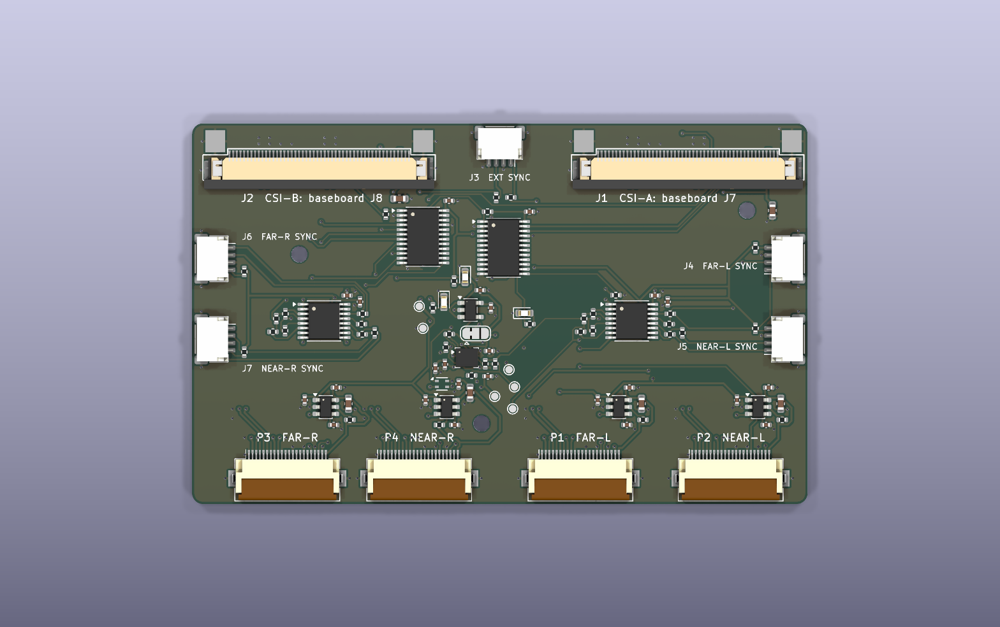
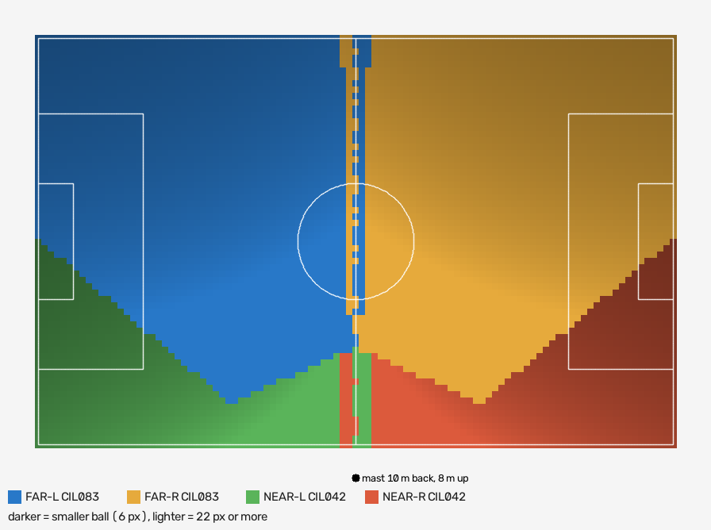
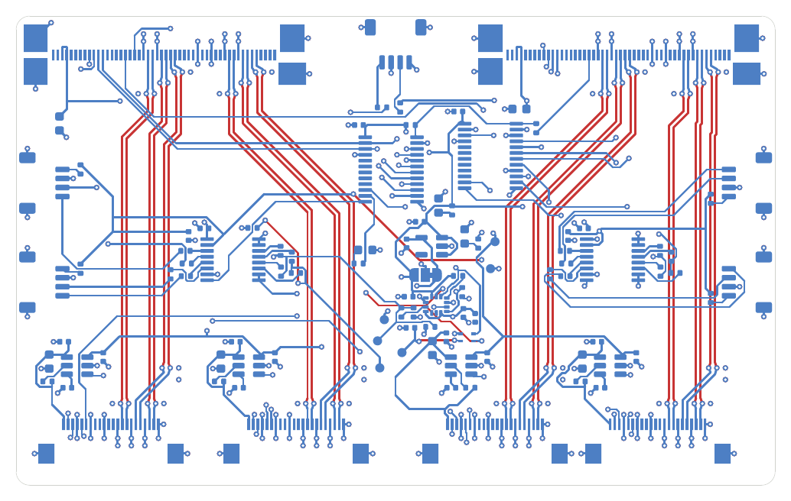

# The pod board: our own cameras instead of the IP domes



Four small Sony IMX678 camera heads in one sealed pod. An RK3588
module in the pod records all four 4K streams to an SSD, and one PoE++
cable runs down the mast. It replaces the IP cameras that the Sideline
Rig Brief (the rig's design doc of 25 September 2026) picks in Part 1,
two Reolink RLC-843A domes and two RLC-820A turrets, and shrinks the
brief's Part 3 pod around them. Against the rigs in `../README.md`, it
replaces the cameras, the switch and the recorder.

It is built from one open-hardware carrier and one new board:

- **The carrier** is [Antmicro's Jetson Orin
  Baseboard](https://github.com/antmicro/jetson-orin-baseboard). It is
  built as it is, with one resistor array moved, and it carries a
  [Mixtile Core 3588E](https://www.mixtile.com/core-3588e/) (RK3588).
- **The camera hub** (`hub/`) is the new PCB. It turns the baseboard's
  two 50-pin camera connectors into four Raspberry Pi 5 style camera
  ports. It adds a power switch per camera, a frame-sync bus that makes
  one camera the master, an IMU that samples on the frame pulse and a
  humidity sensor.

**State:** designed and checked in KiCad, and nothing bought, built or
filmed. The hub's schematic passes ERC, and its board passes DRC and
the schematic-parity check (see "The camera hub"). Every figure below
is either sourced or marked as an estimate.

## Why build it: smaller, lighter, and our settings

| | Recommended IP set (brief, Part 1) | Pod board |
| --- | --- | --- |
| Cameras on the mast | 2.44 kg | about 0.1 kg: four heads with lenses (estimate) |
| Whole rig on the mast | about 4.4 kg of a 4.5 kg rating | about 0.9 kg (estimate, see "Power, data, heat and weight") |
| Pod | about 300 x 240 x 300 mm (design v2) | about 160 x 140 x 120 mm (estimate; not drawn yet) |
| Bitrate per camera | 8 Mbps, the camera's maximum | our choice; plan 35 Mbps, test 20 to 50 |
| Shutter | "manual", fastest step not published | set in the sensor: 1/1000 s |
| White balance | whatever the firmware allows | fixed ISP gains for the match |
| Lens | motorized zoom that must return after power-up | fixed M12 lenses, focus locked |
| Frame sync | none | one XVS/XHS pulse drives all four sensors |
| Mast tilt | not measured | an IMU sample tagged to every frame |
| Smallest ball, 11v11 | 9.2 px | 8.0 px (middle of the near goal line) |
| Ball at the far corner | 9.7 px | 10.1 px |
| Cost of the first unit | $500 | roughly $1,300 to $2,200 (estimate, see "What to buy") |

The bitrate decides it, as the brief says. An 8 Mbps stream is the
first thing to smear a 9 px ball; here it is a setting.

## What it sees

`rig_geometry.py --head homebrew-678` models the heads: IMX678 at
3840 x 2160, with Commonlands M12 lenses modelled rectilinear. The
lens angles are Commonlands' own figures for each lens on the IMX678.
The rig is an 8 m mast, 10 m behind the touchline, at halfway:

| | 11v11 (100 x 64 m) | 9v9 (69 x 46 m) | 7v7 (55 x 37 m) |
| --- | --- | --- | --- |
| Smallest ball anywhere | 8.0 px | 10.4 px | 12.7 px |
| Ball at the far corner | 10.1 px | 12.6 px | 15.2 px |
| Smallest player | 61 px | 70 px | 85 px |
| Worst foot position | 0.25 m per px | 0.13 | 0.09 |
| Pitch + 2 m in frame, feet and heads | 100% | 100% | 100% |
| Trials with a gap inside the lines, every camera up to 2 degrees off | 0 of 300 | 0 of 300 | 0 of 300 |

| Camera | Lens | Horizontal angle on IMX678 | Yaw, L / R | Tilt down |
| --- | --- | --- | --- | --- |
| FAR-L, FAR-R | [Commonlands CIL083](https://commonlands.com/products/low-distortion-8mm-m12-lenses), 8.0 mm f/2.8, -0.5% TV distortion | 51 degrees | -24 / +24 | 4 |
| NEAR-L, NEAR-R | [Commonlands CIL042](https://commonlands.com/products/no-distortion-4mm-m12-lens-cil042), 4.2 mm f/2.6, -0.7% TV distortion | 85 degrees | -40 / +40 | 29 |

Aim cards and coverage maps for all three pitches are in `aim/`.



- **Why these aims.** A wider far pair (around 32 degrees of yaw) gets
  the smallest ball up to 9.3 px. But it leaves the middle of the far
  touchline to the near cameras' top edge, and 7 to 27% of the 2-degree
  trials then lose it. The far pair turns in to overlap there instead.
- **Where it gives up to the Reolinks.** Only the middle of each goal
  line, near side, falls below 9 px: 0.9% of the pitch. The Reolinks'
  near lens is a barrel-distorted security lens, which puts more pixels
  in the middle of the frame than a low-distortion one. A barrel M12
  lens of about 86 degrees would close the gap, but none with a
  published IMX678 angle turned up.
- **What was tried.** Nothing in Commonlands' IMX678 list sits at the
  brief's 56 degrees. The 6.2 mm CIL062 (64 degrees) gives 7.9 px;
  8.0 px is the best of the real lens pairs tried.

## What to buy

Prices were checked on 26 September 2026 where a source is linked, and
the rest are estimates marked "about". Check before ordering.

### Compute and carrier

| Qty | Item | Price | Notes |
| --- | --- | --- | --- |
| 1 | [Antmicro Jetson Orin Baseboard](https://order.openhardware.antmicro.com/), rev 1.3.4 | $499, out of stock at CircuitHub | Or build it from the open files; see "Baseboard setup" for the one change |
| 1 | [Mixtile Core 3588E](https://www.mixtile.com/store/som/core-3588e/), RK3588, 16 GB / 128 GB | between $132 (4 GB / 32 GB) and $338 (32 GB / 256 GB) | Jetson SO-DIMM module on 5 V; the 4 GB version should record, 16 GB leaves room |
| 1 | NVMe SSD, M.2 key M, 1 TB | about $80-150 | Recording; the baseboard's M.2 slot |
| 1 each | A second baseboard, module and SSD (fallback only) | see "If one module is not enough" | Only if the bench test fails; the hub splits between two boards as built |

### Camera heads

| Qty | Item | Price | Notes |
| --- | --- | --- | --- |
| 4 | IMX678 camera board with a Raspberry Pi 22-pin connector and an M12 mount, e.g. [Soho Enterprise SE-SB03-IMX678](https://forums.raspberrypi.com/viewtopic.php?t=306964&start=50) | on request | It must bring out XVS and XHS for sync. Soho's boards sync "by XVS"; confirm XHS before ordering |
| 2 | [Commonlands CIL083](https://commonlands.com/products/low-distortion-8mm-m12-lenses), 650 nm IR-cut | $19 each | Far pair |
| 2 | [Commonlands CIL042](https://commonlands.com/products/no-distortion-4mm-m12-lens-cil042), F/2.6, 650 nm IR-cut | $49 each | Near pair; the F/2.6 version resolves 8 MP at 2 um |

[StarlightEye](https://github.com/will127534/StarlightEye) (IMX585,
C-mount) is the open-source alternative. It has twice the pixel area
for dull days, and brings XVS and XHS out on U.FL. It also needs
C-mount lenses of about 12 mm and 6 mm, which weigh several times the
M12s. The hub serves either.

### The hub and cables

| Qty | Item | Price | Notes |
| --- | --- | --- | --- |
| 1 | Camera hub, this board, 4 layers, assembled one side | about $30-50 each in fives (estimate) | `hub/fab/` has the Gerbers, drill, BOM and placement files |
| 2 | 50-pin 0.5 mm FFC, 100-150 mm | a few dollars | Baseboard J7 to hub J1, J8 to J2; pin N to pin N (see "Cables") |
| 4 | 22-pin 0.5 mm FFC (Raspberry Pi 5 camera cable), 150-200 mm | about $3-5 each | Hub P1-P4 to the heads |
| 4 | JST SH 4-pin leads, 150 mm | about $1 each | Sync, hub J4-J7 to each head's XVS/XHS |

### Base station changes (fixed install on PoE only)

A battery pod needs no base case. This is for a pod on PoE.

| Qty | Item | Notes |
| --- | --- | --- |
| 1 | IEEE 802.3bt PoE++ injector, 60 W, e.g. [TP-Link TL-POE170S](https://www.omadanetworks.com/us/business-networking/omada-accessory-poe-adapter/poe170s/), about $50 | Replaces the USW-Flex and the POE-50-60W injector. The baseboard's PD is 802.3bt (TPS2372-3) |

The travel router, mini PC, power station, mast, guys and Cat6 run are
unchanged from `../README.md`. The four camera patch cables and the
switch go, and the mini PC now only previews, serves time and takes
the offload.

### Battery parts (to price once the power board is designed)

| Qty | Item | Notes |
| --- | --- | --- |
| 1 | Power board, this project's, to build | USB-C PD charging, power path, temperature, fuel gauge; see "Power: battery first" |
| 1 | 4S battery pack with its own BMS, 99 Wh or less | Li-ion or LiFePO4; sized from step 1's measured watts |
| 2 | IP67 USB-C panel ports with caps | CHARGE and DATA |
| 1 | Wi-Fi card for an access point in the pod | M.2 or USB |
| 1 | USB-C SSD, 1-2 TB | The offload target |

### First unit, all in (estimate)

| Item | Low | High |
| --- | --- | --- |
| Baseboard | $499 | $499 |
| Mixtile Core 3588E | $132 | $338 |
| NVMe SSD, 1 TB | $80 | $150 |
| Four IMX678 heads, at 250 to 900 RMB each ([retail range](https://knightli.com/en/2026/05/01/sony-imx-camera-module-guide/), not a quote) | $140 | $505 |
| Four lenses | $136 | $136 |
| Five hubs, assembled (the fab's minimum run) | $150 | $250 |
| Cables | $30 | $40 |
| PoE++ injector | $50 | $50 |
| Pod: lid, windows, seals, gland, printing | $100 | $200 |
| **Total** | **about $1,300** | **about $2,200** |

The fallback, a second baseboard with its own module, adds about
$800-1,100 with a second RK3588, or about $2,300-2,600 with two Orin NX
modules in place of the RK3588s (see "If one module is not enough").

## How it connects

There are two ways to power and empty the pod (see "Power: battery
first, PoE for a fixed install"). **Battery is the main one**, as a Veo
is: it needs no cable down the mast, no base case, and nothing for a
parent to set up but the mast. PoE is for a pod left in place at a
home ground.

Battery, the default:

```
 POD (8 m up)
   four heads -- camera hub -- baseboard + RK3588, records to NVMe
                                  |   J12 (9-20 V DC in)    Wi-Fi access point
                              power board (to build)          |
                                  |                          phone (preview, aiming,
                              battery pack, 99 Wh            battery %, start/stop)
   two capped IP67 USB-C ports in the shell:
     CHARGE -> power board            DATA -> baseboard USB-C, 10 Gbps
```

At home: a USB-C laptop charger on CHARGE, and a USB-C SSD on DATA,
which the pod fills on its own.

PoE, for a fixed install:

```
 POD (8 m up)
   NEAR-L   FAR-L    NEAR-R    FAR-R        IMX678 heads, M12 lenses
     |         |        |         |          22-pin FFC + SH 4-pin sync lead each
     +---P2----P1-------P4--------P3---+     (ports in board order, top view)
     |        camera hub (hub/)         |     power switch per head, sync bus,
     +--J1 (50-pin)------J2 (50-pin)---+     IMU, humidity
          |                 |
         J7                J8                 two 50-pin FFCs
     Antmicro Jetson Orin Baseboard
       + Mixtile Core 3588E (RK3588)          records to NVMe
       RJ45, 802.3bt PD
          |
          |  one 15 m outdoor Cat6 down the mast
          |
 BASE CASE
     802.3bt injector -- travel router 192.168.50.1 -- mini PC 192.168.50.2
     power station                        |  Wi-Fi
                                        phone (preview, aiming)
```

## The camera hub (`hub/`)



The hub is 84 x 52 mm, four layers, with every part on one side (B.Cu,
as on Antmicro's own camera boards).

| Ref | Part | Job |
| --- | --- | --- |
| J1, J2 | Wurth 68715014522, 50-pin 0.5 mm | From baseboard J7 (CSI0 + CSI2) and J8 (CSI1 + CSI3); Antmicro's footprint |
| P1-P4 | Hirose FH12-22S-0.5SH | FAR-L, NEAR-L, FAR-R, NEAR-R camera ports, Raspberry Pi 5 22-pin pinout, 2 lanes wired |
| J4-J7 | JST SH 4-pin | Head sync: 1 XVS, 2 XHS, 3 GND, 4 VIO reference out (through 100 ohm) |
| J3 | JST SH 4-pin | External sync in or out: 1 XVS, 2 GND, 3 XHS, 4 GND, at 3.3 V |
| U3-U6 | TI TPS22917 | Per-head 3.3 V switch; 1 nF slows the turn-on, and a 100 ohm discharge resets a head properly |
| U1, U2 | NXP PCA9555 | Head power, enables, sync direction and output enable; its pull-ups start every head powered, enabled and isolated |
| U8, U9 | TI SN74AVC4T774 | XVS/XHS level shift (1.8 V heads, 3.3 V bus), direction per head, all isolated until set |
| U10 | TDK ICM-42688-P | IMU at 0x69; FSYNC on the frame pulse tags the sample nearest each frame |
| U11 | Sensirion SHT45 | Pod air temperature and humidity at 0x44 |
| U7, JP1 | AP2112K-1.8, solder jumper | Sensor-side sync level: 1.8 V (default) or 3.3 V |
| D1-D3 | Green 0603 LEDs | Status per expander (D1, D2), and 3.3 V present (D3) |
| TP1-TP6 | 1 mm test pads | XVS, XHS, 3.3 V A, 3.3 V B, 1.8 V, ground |
| H1-H3 | M2 mounting holes | Tracks and vias kept out from under the screw heads |

**MIPI.** Each head gets three 100-ohm pairs: D0, D1 and the clock. The
widths are 0.25 mm traces 0.25 mm apart on F.Cu, over a solid In1
ground plane, and they come to about 100 ohms on JLCPCB's
JLC04161H-7628 stackup. Confirm that with JLCPCB's calculator when
ordering. The pairs drop to B.Cu only at the two connectors, and each
drop has ground vias beside it. The 50-pin connector orders the lanes
D1, D0, CLK and the Raspberry Pi orders them D0, D1, CLK, so one pair
per head crosses. D1 drops to B.Cu about 8 mm above its port and passes
under D0, the only place any pair leaves F.Cu mid-run.

**Frame sync.** The heads' XVS and XHS meet on a 3.3 V bus. For each
head, the expander sets its translator direction:

- **High (default): the bus drives the head.** The head is a slave.
- **Low: the head drives the bus.** It is the master.

Make exactly one head the master, or none if something external drives
J3 (a Pico, or a GNSS pulse). Then clear the output enable. The
translators start isolated, so nothing fights at power-up. If a setting
is wrong, 47 ohm and 33 ohm series resistors limit the fight.

The bus's XVS reaches the SoM through J1 pin 32, the baseboard's
VSYNC_CAM0 line (CAM0_PWDN), so every frame can be timestamped. It also
reaches the IMU's FSYNC. The IMU's interrupt goes out on J1 pin 34.

**I2C.** The baseboard's PI4MSD5V9548A mux gives each camera its own
bus, pulled up to 3.3 V:

| Mux channel | Baseboard pins | Hub devices | Head |
| --- | --- | --- | --- |
| 0 | J7 39/40 | U1 PCA9555 0x20, U10 IMU 0x69, U11 SHT45 0x44 | FAR-L (P1) |
| 1 | J7 41/42 | none | NEAR-L (P2) |
| 2 | J8 39/40 | U2 PCA9555 0x20 | FAR-R (P3) |
| 3 | J8 41/42 | none | NEAR-R (P4) |

**Expander bits** (U1 serves FAR-L and NEAR-L, U2 serves FAR-R and NEAR-R):

| Bit | IO0_0 | IO0_1 | IO0_2 | IO0_3 | IO0_4 | IO0_5 | IO0_6 | IO0_7 | IO1_0 | IO1_1 | IO1_2 |
| --- | --- | --- | --- | --- | --- | --- | --- | --- | --- | --- | --- |
| Signal | FAR 3V3 on | FAR CAM_IO0 | FAR CAM_IO1 | FAR sync dir | NEAR 3V3 on | NEAR CAM_IO0 | NEAR CAM_IO1 | NEAR sync dir | sync OE (low = on) | status LED | IMU INT1 (U1 only) |

**Layers.** F.Cu carries the MIPI pairs and a ground pour, over In1, a
solid ground plane. In2 carries some slow signals and a ground pour,
and stays solid under the pairs' short B.Cu runs. B.Cu carries the
parts, most slow signals and a ground pour. Every ground pad has its
own via into the planes.

**Checks.** `hub/gen/fab.py` runs KiCad 9's own checks and rebuilds
`hub/fab/`: ERC on the schematic, and DRC with the schematic-parity
check on the board. As committed, ERC finds no errors or warnings, and
DRC finds no violations, no unconnected pads and no parity errors
(`hub/fab/erc.rpt`, `hub/fab/drc.rpt`). The generator in `hub/gen/`
placed the parts, drew the MIPI pairs, gave every ground pad its via,
and had Freerouting 1.9.0 route the rest. Edit the KiCad files from
here on: the generator is a record of how rev A was made, and
rerunning it (`hub/gen/build.sh`) overwrites hand edits. The autorouter
is not deterministic, so a rerun routes the slow signals a little
differently; a rebuild from scratch was checked and passes the same
checks.

## Baseboard setup

Four 2-lane cameras need one change and one check on the baseboard.

- **Move R108 to R122.** As shipped, R108 sends CSI3's lanes to J7 as
  lanes 2 and 3 of a 4-lane camera, and R122 (not fitted) would send
  them to J8. Fit R122, remove R108, and J8 carries two 2-lane cameras
  like J7 (`csi.kicad_sch`). Order the board that way, or rework the
  0201 array by hand.
- **The GPIO lines.** J7 pins 32 and 34 carry the hub's frame pulse
  and IMU interrupt to the module's CAM0_PWDN and CAM1_PWDN through
  R12 and R11, fitted as shipped. J8 pin 32 carries the expanders'
  interrupt, which reaches the module's GPIO12 only if R4 (not fitted)
  is added; the software can poll the expanders instead. Both pairs
  pass NXP NTS0102 auto-direction translators (U31, U32), so the hub
  can drive them.
- **Module power.** Rev 1.3.x feeds the module 12 V or 5 V according to
  MODULE_ID. The Mixtile module ties that pin to ground (Mixtile's pin
  comparison table), which should select the 5 V rail. Measure VDD_SoM
  at the socket before fitting the module: it must read 5 V.
- **RTC.** BT1 is an MS621FE, a rechargeable cell, so the module's PMIC
  may charge it.
- **I2C pull-ups** go to 3.3 V as shipped (R166, R174 fitted), which is
  what Raspberry Pi style heads expect.

## If one module is not enough: add a second

The fallback is more compute, not a different single module. No module
that fits this socket records four 4K25 streams with margin, so if the
bench test fails, the pod gets a second baseboard and module, and each
records two cameras.

**Why not a single Orin NX.** It was the fallback here until 4 October
2026, and it does not fit the load. Its H.265 encoder is rated at
1x 4K60 or 3x 4K30, about 800 megapixels a second, and four heads at
3840 x 2160 and 25 fps need about 830. The Orin Nano has no hardware
encoder at all.

| One module, four heads at 4K25 (about 830 MP/s) | Encoder | Image processors |
| --- | --- | --- |
| RK3588 (H.265 8K30, about 995 MP/s) | 83% | Two heads on each of its two ISPs, the documented limit; this is what the bench test checks |
| Orin NX 16GB (about 800 MP/s) | 104%, does not fit | n/a |

| Two modules, two heads each (about 415 MP/s each) | Encoder | Image processors |
| --- | --- | --- |
| Two RK3588 | 42% each | One head per ISP: the shared-ISP limit no longer applies |
| Two Orin NX 16GB | 52% each | NVIDIA's own ISP; an IMX678 driver for Jetson must be found or ported |

**Which second module.** Try a second RK3588 first. The bench test's
real risk is two 4K heads sharing one ISP, and two boards remove the
sharing, while the software stays one platform. Move to two Orin NX
only if the RK3588 fails for another reason: drivers, the ISP tuning,
or the encoder's rate control.

**The hub splits as built.** J1 serves FAR-L and NEAR-L, and J2 serves
FAR-R and NEAR-R, so no new board is needed:

- **Cables.** Board A's J7 goes to hub J1, as now. Board B's J7 goes to
  hub J2, in place of board A's J8. Order both baseboards with the same
  resistor change ("Baseboard setup") so they are identical.
- **Power.** Each board powers its own 3.3 V rail: board A powers
  +3V3A and board B powers +3V3B. But the expanders, translators, IMU
  and 1.8 V regulator all run on +3V3A. So board A must be up before
  board B's heads can be switched on, and board B's heads lose their
  sync and power control if board A goes down.
- **Control.** U1 answers on board A's mux channel 0, and U2 on board
  B's mux channel 0, each at 0x20. Each board clears its own
  expander's OE in sync bring-up step 3.
- **Sync.** All four heads stay on one XVS/XHS bus, with FAR-L the
  master. Only board A receives the frame pulse (J1 pin 32). Board B's
  pin 32 carries the expanders' interrupt instead, to its CAM0_PWDN
  GPIO, which is fitted as shipped. Board B pairs its frames with board
  A's by timestamp: both run chrony against the mini PC, which is
  sub-millisecond against a 40 ms frame.
- **Network.** Each baseboard has one RJ45 and one 802.3bt PD, so the
  simplest build is two Cat6 runs down the mast and two injectors at
  the base. An in-pod PoE switch would save a cable, at the cost of
  weight and heat.

**What it costs.**

| | Second RK3588 board | Two Orin NX boards |
| --- | --- | --- |
| Parts added to the first unit | baseboard $499, module $132-338, SSD $80-150, injector $50, Cat6 and gland $20-40 | the same baseboard, SSD, injector and cable, plus two Orin NX at $999 each in place of the RK3588 |
| Added cost (estimate) | about $800-1,100 | about $2,300-2,600 |
| Power in the pod (estimate) | about 22-30 W | about 35-45 W (both modules in a 15 W mode) |
| Finned lid for a 20 C rise (same rule as below) | about 900-1,250 cm2 | about 1,450-1,900 cm2 |
| Weight added (estimate) | about 0.2-0.3 kg (board, module, SSD, a larger lid) | about 0.3-0.4 kg |

The lid is the hard part: the pod in "The pod" is sized for one 15 W
module. Re-size it before printing if the fallback is taken.

## Cables

- **50-pin.** Baseboard J7 pin N must reach hub J1 pin N, and J8 must
  reach J2 the same way. The hub mounts its 50-pin connectors like
  Antmicro's own camera boards: underside, same footprint, turned
  180 degrees so the cable leaves the top edge. So the FFC type
  Antmicro uses with those boards, laid the same way, maps pin to pin.
  A fold in the pod flips which cable type is needed. Check pins 1, 11
  and 50 with a meter before power.
- **22-pin.** The hub's ports are pinned like a Raspberry Pi 5's, so a
  head that works on a Pi 5 works here. Contacts sit on the underside
  (bottom-contact FH12), so check the head end's contact side before
  buying cables.
- **Sync.** Soho-style heads with XVS/XHS pads need a JST SH lead
  soldered to the pads. StarlightEye needs an SH to 2x U.FL lead. Pin 4
  of the hub's SH is a reference voltage, not power, so leave it
  unconnected unless the head needs a level to pull XMASTER to.

## Recording

The software is not written yet; this is what it has to be. Per head:

```
sensor (IMX678 driver, slave or master) -> rkcif -> rkisp (rkaiq 3A, fixed exposure and white balance)
  -> Rockchip MPP H.265 encoder -> ten-minute MKV segments on the NVMe, cut on the clock like record.sh
```

The starting pipeline to bench-test, one per head:

```
gst-launch-1.0 -e v4l2src device=/dev/video-far-l io-mode=dmabuf \
  ! video/x-raw,format=NV12,width=3840,height=2160,framerate=25/1 \
  ! mpph265enc rc-mode=vbr bps=35000000 bps-max=40000000 gop=25 \
  ! h265parse ! splitmuxsink muxer=matroskamux max-size-time=600000000000 location=/data/rec/far-l_%05d.mkv
```

- **Capture.** GStreamer rather than ffmpeg. The RK3588 camera path
  exposes only the V4L2 multi-planar API, which stock ffmpeg does not
  capture.
- **Rate control.** MPP's CBR is reported not to hold a fixed bitrate on
  RK3588, so start with capped VBR and measure it
  ([rockchip-linux/mpp #429](https://github.com/rockchip-linux/mpp/issues/429)).

| Setting | Value |
| --- | --- |
| Resolution, rate | 3840 x 2160, 25 fps (the bench test decides whether 30 fits) |
| Codec | H.265, a keyframe every second |
| Bitrate | 35 Mbps per head to start; test 20, 35 and 50 on real footage |
| Exposure | Manual, 1/1000 s, gain capped |
| White balance | Fixed gains for the match, the same on all four |
| Off | Lens correction, stabilisation, crop, HDR, 3D noise reduction above low |
| Time | chrony against the mini PC (192.168.50.2); the module's RTC holds it otherwise |
| Preview | One low-resolution stream per head over RTSP, scaled by the RGA |

Sync bring-up, on the FAR-L bus (mux channel 0) and the FAR-R bus (channel 2):

1. **Outputs.** First write the output registers 0x02 and 0x03 with the
   pull-up defaults (0xFF, 0x03), so nothing glitches. Then write 0x00
   to configuration register 0x06 and 0xFC to 0x07. That makes port 0
   and IO1_0-IO1_1 outputs and leaves IO1_2 an input: on U1 it is the
   IMU's push-pull interrupt.
2. **Master.** Set FAR-L's sync direction (U1 IO0_3) low and the other
   three high. Put FAR-L's sensor in master mode and the rest in slave
   mode.
3. **Enable.** Clear OE (IO1_0) on both expanders.
4. **Check.** Count XVS edges on TP1 and on the SoM's frame-pulse GPIO:
   25 per second.

## Power, data, heat and weight

Estimates, all of them, until the bench test measures them.

| | Figure | Basis |
| --- | --- | --- |
| Power in the pod | about 12-18 W | RK3588 encoding four streams 6-10 W, four sensors about 2 W, NVMe 2-3 W writing, conversion losses |
| PoE budget | 51 W at the PD | 802.3bt Type 3 (TPS2372-3); with the two-board fallback, each board has its own PD and its own 51 W |
| Data | 140 Mbps at 35 Mbps a head | 63 GB an hour; 95 GB for 90 minutes; a 1 TB SSD holds about ten matches |
| Offload | about 2-4 minutes a match to a USB-C SSD; about 16 over gigabit Ethernet (fixed install) | 95 GB |
| Battery | 2-3 matches on 99 Wh | 26-40 Wh a match; see "Power: battery first" |
| Heat | about 600 cm2 of finned lid for a 20 C rise | 15 W, still air plus radiation at about 12 W per m2 per C; sun on a white lid adds a few watts |
| Weight on the mast | about 0.9 kg on PoE; about 1.5-1.8 kg with the battery | Heads and lenses 0.1, baseboard, module, SSD and hub 0.1, finned aluminium lid 0.2, printed shell and frame 0.35, windows, seals, gland and screws 0.15; a 99 Wh pack 0.6 (Li-ion) to 0.9 (LiFePO4) |

## Power: battery first, PoE for a fixed install

The pod should be as easy as a Veo: charge it, put it up, press one
button, bring it home, plug in. So the battery is the main power, and
USB-C is how it charges and how the footage comes out. PoE stays, for a
pod mounted permanently at one ground, where a cable is no burden.

**What the baseboard already gives**
([Antmicro's board overview](https://antmicro.github.io/jetson-orin-baseboard/board_overview.html)):

- **J12, a locking DC input** that takes 9-20 V (rev 1.3.0 and later).
  Antmicro names a battery pack as a valid source. A 4S Li-ion pack
  (12-16.8 V) and a 4S LiFePO4 pack (10-14.6 V) both fit.
- **No charging.** In Antmicro's words, "battery (re-)charging is
  currently not supported in the design." That is the power board's job.
- **J4, a USB-C port** with 10 Gbps data and USB PD. Its TPS65988
  controller is configured as a power sink on CircuitHub-built boards,
  20 V recommended. It can run the board from a laptop charger, but it
  cannot charge a battery.
- **J6, 802.3bt PoE**, up to 60 W: the fixed-install path, unchanged.

**The battery** (estimates until the bench test measures the pod's real
draw):

| | One RK3588 (12-18 W) | Two-board fallback (22-45 W) |
| --- | --- | --- |
| Energy per match, about 2 hours with setup | 26-40 Wh | 45-90 Wh |
| Matches on a 99 Wh pack | 2-3 | 1, sometimes 2 |
| Pack weight, Li-ion / LiFePO4 | about 0.6 / 0.9 kg | same |
| Charge time at 60 W / 100 W | about 2 / 1.3 hours | same |

- **99 Wh** is the most that flies as carry-on without airline approval.
- **Weight.** The pod on the mast grows from about 0.9 kg to about
  1.5-1.8 kg, well inside the mast's 4.5 kg rating.
- **Heat is the battery's real risk.** Li-ion is rated to discharge up
  to about 60 C and charge between 0 and 45 C, and the lid's target is
  "under 60 C" in sun. So:
  - the pack sits at the bottom of the pod, shaded, away from the module;
  - it never charges while hot or below freezing;
  - the power board stops discharge on an over-temperature.

  LiFePO4 is heavier but more tolerant, and safer in a sealed box over a
  youth pitch; the choice waits on the pod's measured temperatures.

**The power board (to build).** A small PCB designed in KiCad as the
hub was, between the pack and the baseboard's J12. It is on the build
order below. It must:

- **Charge from USB-C PD**: a standalone PD sink controller asking for
  20 V, up to 100 W, from any laptop charger.
- **Charge the pack with power path** through a 1-4S buck-boost charger
  (TI's BQ25798 is the class of part; confirm its current limit against
  the pack). The baseboard then runs from the charger while it is
  plugged in. Plugging or unplugging must never drop the baseboard, so
  the pod can record or offload while charging.
- **Watch temperature**:
  - NTC thermistors on the pack, on the charger's temperature pins, with
    a JEITA charge profile: no charging outside 0-45 C;
  - a second sensor near the module;
  - a hard cut-off of discharge above the pack's rating;
  - both temperatures readable over I2C, alongside the hub's SHT45.
- **Gauge the pack**: a fuel gauge, read over I2C, so the phone shows
  battery percent and minutes left.
- **Shut down cleanly**: a low-battery signal to a module GPIO, so the
  recorder closes its segments before the power goes.
- **Give the controls a parent needs**: one power button and a few
  LEDs (battery, recording, offload done).
- **Stay out of PoE's way**: in a fixed install, PoE powers the
  baseboard and the power board must not back-feed it. How the
  baseboard combines J6, J12 and J4 has to be read from its schematic
  first.
- **Leave cell protection to the pack**: buy a pack with its own BMS,
  and do not put one on this board.

**Getting the footage out.** A match is about 95 GB.

| Way | Time per match | State |
| --- | --- | --- |
| The pod copies to a USB-C SSD plugged into DATA | about 2-4 min | Ordinary USB host mode; the default |
| The pod shows up as a drive on a laptop | about the same | Needs J4's lines to reach an RK3588 controller that can be a USB device, which the Jetson pin map does not settle |
| Gigabit Ethernet, fixed install | about 16 min | As before |
| Wi-Fi | about 30-50 min | Last resort |

**Without a base case**, two jobs move into the pod:

- **Preview.** A Wi-Fi access point in the pod (an M.2 or USB card)
  serves the phone's preview, aiming, battery percent and start/stop.
- **Time.** The module's RTC keeps time. Add a GNSS receiver only if
  footage must line up with other recordings. In the two-board
  fallback, the boards sync to each other over a short Ethernet cable
  inside the pod.

## The pod: what changes from design v2

The CAD re-fit is not done; it waits on real heads to measure, as
Part 3 always did. These are the rules it follows.

- **Sealed, not a rain screen.** The IP cameras were weatherproof and
  these boards are not. So the pod gets:
  - an O-ring on every seam and window;
  - an ePTFE vent and desiccant;
  - a conformal coat on the hub;
  - two capped IP67 USB-C panel ports, CHARGE and DATA;
  - a cable gland for the Cat6, on fixed-install pods only.
- **The battery sits low.** The pack goes at the bottom of the pod,
  shaded and away from the module and lid, with its thermistors bonded
  to the cells.
- **The lid is the heatsink.** The module faces up against the finned
  aluminium lid through a gap pad, and the lid shades everything below
  it. Size the lid before the shell.
- **Windows.** Four anti-reflection glass ports sit in front of the M12
  lenses. Each has a matte black rim and room for 5 degrees of trim
  either way, as in design v2's flush-window rules.
- **Seats.** The heads bolt to printed seats that carry the aims in the
  table above: far pair +/-24 degrees yaw at 4 down, near pair
  +/-40 degrees at 29 down. The aims differ from design v2's, so
  `sideline_pod.scad`'s seats and windows move. `check_pod.py`'s view
  checks apply unchanged.
- **Unchanged.** The mast stud, the tether, the guy lines and the aim
  cards all stay.

## Build order

Prove the risky parts on the bench before ordering anything big; each
step has a pass condition.

| Step | Work | Pass condition |
| --- | --- | --- |
| 1. Bench worst case | Two IMX678 heads on one RK3588 ISP at 4K25 (any RK3588 board with two camera ports), locked exposure and white balance, 35 Mbps each. Log the board's input power throughout | 90 minutes, no dropped frames, recorded bitrate within 10% of the target; watts measured, which sizes the battery |
| 2. Field A/B | One head beside an RLC-843A at a real match; `spike/evals/ball_recall.py` on both | Fewer and shorter ball gaps than the Reolink |
| 3. Hub and baseboard | Order two hubs and one baseboard (R122 fitted); bring up all four ports; set a master | Four synced streams for a full match; XVS on every head within 1 us |
| 4. Power board | Read how the baseboard combines J6, J12 and J4; design the power board ("Power: battery first") in KiCad, with ERC and DRC clean as the hub's are; order it and a pack sized from step 1 | A full match on battery; the charger plugged and unplugged mid-recording without a dropped frame; no charging below 0 or above 45 C (checked with a freezer and a heat gun); segments closed cleanly at low battery; battery percent on the phone |
| 5. USB-C offload and Wi-Fi | Panel USB-C from J4; copy to an inserted SSD on its own; a Wi-Fi access point in the pod for preview and start/stop | 95 GB to an SSD in under 5 minutes; preview and start/stop from a phone with no base case |
| 6. Pod | Re-fit `sideline_pod.scad` with the battery low and the two USB-C ports, print, seal, aim with the cards in `aim/` | `check_pod.py` passes; each view matches its card; lid under 60 C and pack under its rating in sun |

## Not verified yet

- **The hub is a design, not a board.** Its checks pass, but no copper
  has been made, and nobody has put the MIPI pairs on a scope. The
  impedance is a formula estimate for JLCPCB's stackup. The slow
  signals are autorouted and correct by DRC, not tidied by hand.
- **The fab files are unordered.** The placement file's rotations are
  KiCad's; check every part in the fab's placement preview, since
  bottom-side parts often need correcting. The BOM names manufacturer
  parts for the ICs, connectors and LEDs, and values for the passives;
  it has no LCSC numbers yet.
- **The FFC mapping.** The 50-pin orientation copies Antmicro's
  arrangement, and the reasoning is written above, but no cable has
  been checked.
- **Four 4K cameras on one RK3588.** Two cameras sharing an ISP are
  capped at 3840 x 2160 each and need rkisp_3A_server. That is exactly
  this load, and it is the bench test. If it fails, the fallback is a
  second board ("If one module is not enough"), which is designed on
  paper only.
- **The heads.** Soho Enterprise's IMX678 boards are samples, stock is
  short, and whether XHS comes out is unconfirmed. Khadas runs IMX678 at
  4K on RK3588S, so a driver exists to port. An IQ tuning file for these
  lenses does not.
- **The lens angles** are Commonlands' figures, not measured on these
  sensors.
- **MODULE_ID and the 5 V rail**, as above: measure before fitting the
  module.
- **Heat** in a sealed pod in sun, and **weight**, are estimates.
- **Battery and USB-C** are on paper:
  - The power board is not designed.
  - The battery life follows from estimated watts.
  - Whether the baseboard's USB-C can act as a USB device on the RK3588
    is unknown.
  - How J6, J12 and J4 share power on the baseboard has not been read
    from its schematic.
- **The pipeline still takes one camera per match**, as `../README.md`
  says.

## Files

| Path | What |
| --- | --- |
| `hub/sideline-cam-hub.kicad_pro`, `.kicad_sch`, `.kicad_pcb`, `.kicad_dru` | The camera hub, KiCad 9, and its one custom design rule (one thermal spoke is enough where a ground pad has its own via) |
| `hub/sideline.kicad_sym`, `hub/sideline.pretty/`, `hub/sideline.3dshapes/` | Two symbols KiCad lacks, and Antmicro's 50-pin footprint and model (Apache-2.0; see `hub/NOTICE`) |
| `hub/fab/` | Gerbers and drill (zipped), BOM, placement, schematic PDF, bottom assembly drawing, ERC and DRC reports |
| `hub/renders/` | Board renders |
| `hub/gen/` | How rev A was generated: netlist, schematic, placement, MIPI routing, autorouting; `build.sh` runs it all |
| `aim/` | Aim cards and coverage maps for the homebrew head, three pitch sizes |
| `../rig_geometry.py --head homebrew-678` | The numbers in "What it sees" |

## Sources

- [Antmicro Jetson Orin Baseboard](https://github.com/antmicro/jetson-orin-baseboard): schematic, layout and board overview
- [Antmicro baseboard on CircuitHub](https://order.openhardware.antmicro.com/) ($499, rev 1.3.4) and [on System Designer](https://antmicro.com/blog/2026/06/antmicro-baseboard-for-jetson-orin-on-system-designer)
- [Antmicro OV5640 dual camera board](https://github.com/antmicro/ov5640-dual-camera-board): the 50-pin connector's pin use and footprint
- [Mixtile Core 3588E](https://www.mixtile.com/core-3588e/), its [store page](https://www.mixtile.com/store/som/core-3588e/), [data sheet](https://www.mixtile.com/app/uploads/2024/05/Mixtile-Core-3588E-Data-Sheet_v1.3.pdf) and [pin comparison with Jetson](https://downloads.mixtile.com/core3588e/file/CORE3588E_Pin_Function_Comparision_with_Jetson_rev01.pdf)
- [Turing RK1 specifications](https://docs.turingpi.com/docs/turing-rk1-specs-and-io-ports): another RK3588 module on the same socket
- [Commonlands IMX678 lens guide](https://commonlands.com/pages/image-sensors/imx678), [CIL083](https://commonlands.com/products/low-distortion-8mm-m12-lenses), [CIL042](https://commonlands.com/products/no-distortion-4mm-m12-lens-cil042)
- [Soho Enterprise IMX678 boards (Raspberry Pi forum thread)](https://forums.raspberrypi.com/viewtopic.php?t=306964&start=50)
- [StarlightEye](https://github.com/will127534/StarlightEye): open IMX585 board, ICM-42688-P wiring, sync on U.FL
- [FRAMOS: multi-sensor synchronization](https://docs.framos.com/en/latest/FSMEcosystem/ApplicationGuides/MultiSensorSynchronization.html): IMX678 master/slave with XVS and XHS
- [Khadas Edge2 cameras](https://docs.khadas.com/products/sbc/edge2/add-ons/imx415-mipi-camera): IMX678 and IMX585 at 4K on RK3588S
- [TI SN74AVC4T774](https://www.ti.com/lit/ds/symlink/sn74avc4t774.pdf), [TI TPS22917](https://www.ti.com/lit/ds/symlink/tps22917.pdf), [NXP PCA9555](https://www.ti.com/lit/ds/symlink/pca9555.pdf) (TI's equivalent sheet)
- [TDK EV_ICM-42688-P board note](https://mm.digikey.com/Volume0/opasdata/d220001/medias/docus/8927/EV_ICM-42688-P.pdf): the IMU's pin-out
- [rockchip-linux/mpp issue 429](https://github.com/rockchip-linux/mpp/issues/429): CBR on RK3588
- [TP-Link TL-POE170S](https://www.omadanetworks.com/us/business-networking/omada-accessory-poe-adapter/poe170s/): 802.3bt injector
