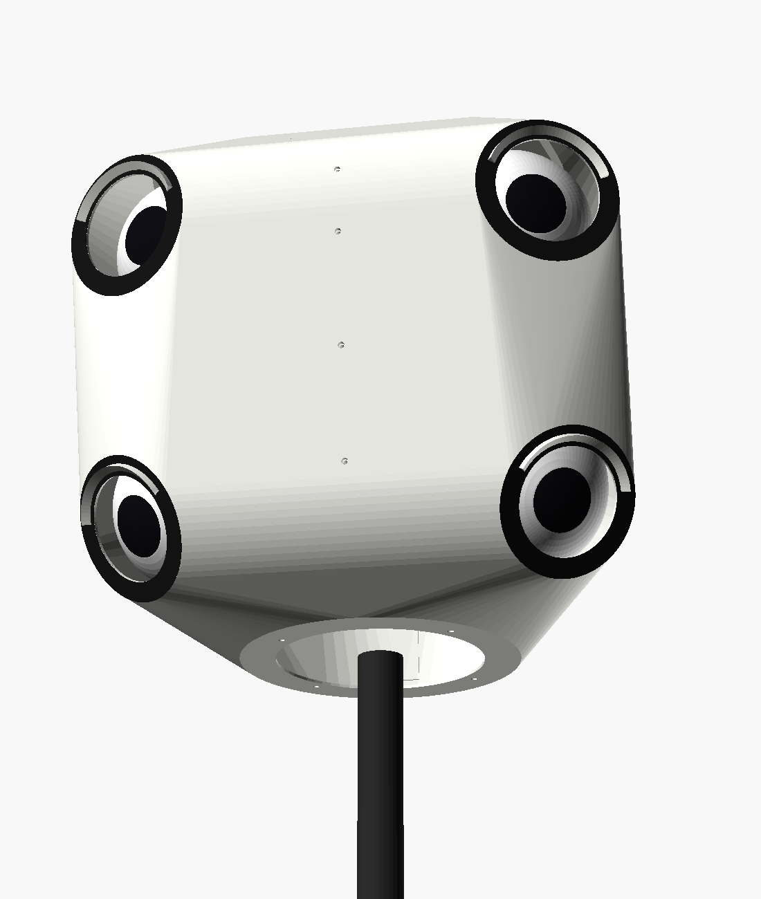
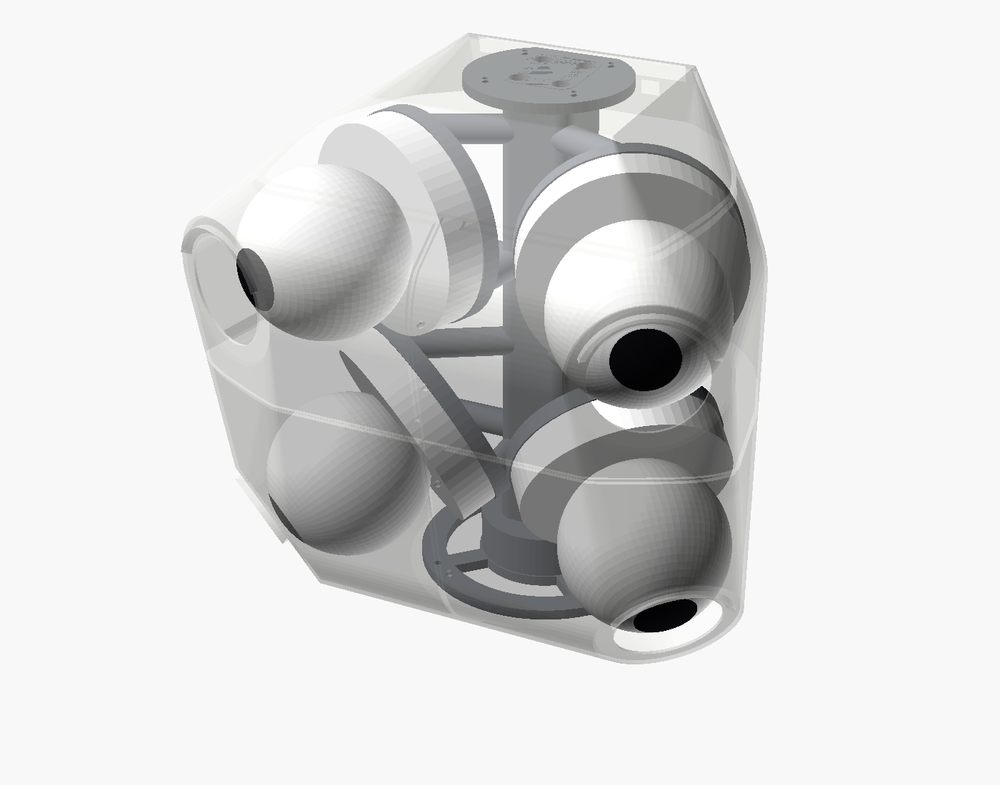
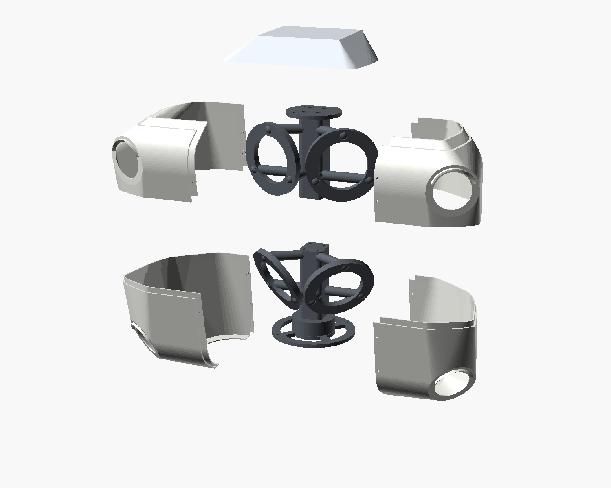

# The hidden pod



Four Reolink RLC-833A turret cameras in one printed housing, on the same
mast, switch and recorder as the open head (`../README.md`). Each lens sits
behind a flush round port with a matte black rim, so from the touchline the
rig reads as one sports camera rather than four security cameras on a
stick. The four cameras cost about $310-420; the open head's four
Milesights cost about $1,580.

Everything here is arithmetic and geometry checks. Nothing has been printed
or filmed yet, and the first thing to measure is at the end, under "Not
verified yet".

## Why a zoom turret, and what it gives up

Megapixels do not fix the far corners; pixels per degree do. Each of these
is aimed as well as it can be, from the same mast and lens model:

| Cameras | Smallest ball, 11v11 |
| --- | --- |
| four RLC-810A (4K, fixed 87 degrees), the cheapest 4K Reolinks | 6.3 px |
| four P340 (12 MP, fixed 93 degrees) | 7.1 px |
| the open head: Milesight, 6 mm far pair, 4 mm near pair | 8.6 px |
| **the pod: four RLC-833A, far pair zoomed to 54 degrees, near pair at 84** | **9.3 px** |

A 12 MP sensor spread over 93 degrees puts fewer pixels on a far ball than
4K over 54. The RLC-833A's 3x zoom (94 to 50 degrees) lets one model serve
both pairs. Its ball is also its own swivel, so a round hole in front of it
is all the housing needs.

What it gives up, against the open head's Milesight MS-C8164-PD:

| | Milesight | RLC-833A | Why it matters |
| --- | --- | --- | --- |
| Bitrate | 16 Mbps | **8 Mbps** | a 9 px ball is the first thing a starved encoder smears |
| Frame rate at 4K | 30 fps | 25 fps | a 20 m/s shot moves 0.8 m between frames instead of 0.67 m |
| Shutter | manual, to 1/100,000 s | "Manual" with a shutter range; the fastest step is not published | at 1/60 s a struck ball is a streak |
| Lens | fixed | motorized zoom | it must come back to the same zoom after every power-up |
| Protection | IP67, IK10 | IP66, no impact rating | the pod takes the ball, not the camera |
| Weight | 450 g | 510 g | the rig on the mast goes from 2.9 kg to 3.9 kg |

The bitrate is the one that decides it. Record a match with one RLC-833A
before buying four (see "Not verified yet").

## What it sees

Same spot as the open head: an 8 m mast, 10 m behind the touchline, at
halfway.

| | 11v11 (100 x 64 m) | 9v9 (69 x 46 m) | 7v7 (55 x 37 m) |
| --- | --- | --- | --- |
| smallest ball anywhere | 9.3 px | 12.5 px | 15.2 px |
| ball at the far corner | 10.0 px | 12.6 px | 15.2 px |
| smallest player | 67 px | 81 px | 99 px |
| worst foot position | 0.25 m per px | 0.13 | 0.09 |

- **Coverage.** The whole pitch is in frame, feet and heads, including the
  far touchline.
- **The 2 m margin outside the lines.** On 9v9 and 7v7 all of it is in
  frame. On 11v11, all but the heads just outside the two near corner flags
  (99.9%), and all of it from 12 m back.
- **Aiming error.** With every camera up to 2 degrees off, nothing inside
  the lines drops out in 300 random trials on any of the three pitches.

The aims come from `python hardware/rig_geometry.py --head reolink-833a`:

- far pair: yaw ±26, tilt 4 down, zoomed to 54 degrees;
- near pair: yaw ±39, tilt 27, at 84 degrees.

The pod's seats carry these aims. Aim cards for all three pitches are in
`aim/`.

## The pod



- **Flush windows.** The pod is the convex hull of four things: a window
  disc in front of each camera, the camera bases, a roof and back, and a
  floor ring.
  - Each window is a face of that hull, so nothing of the pod stands in
    front of a window's plane.
  - The housing never enters a view, and a camera can be trimmed 5 degrees
    either way before its own port does.
- **Rain.**
  - The far windows stand 15 mm in front of the lens, a porthole that keeps
    rain and low sun off the glass.
  - A drip brow over every window sends water round the sides.
- **A rain screen, not a seal.** The cameras are IP66 on their own. Air
  comes in through the floor round the mast and leaves through slots under
  the eave at the back, so the cameras sit in shade and moving air, not in
  a sealed box in the sun.
- **Frame and shell.**
  - A printed frame inside carries everything: a core on the mast stud, a
    seat ring for each turret on three struts, a floor ring and a top plate.
  - The shell only covers, and screws to the frame at the floor and the
    roof.
- **Size.** About 300 x 240 x 300 mm, 1.2 kg of prints; 3.9 kg on the mast
  with cameras, switch and cables.

The shell prints as a cap and four quarters:

- **Seams.** Every seam is a butt joint outside with a tongue behind it.
- **Level seams.** The tongue rises from the piece below, so water that
  creeps into a seam runs back out.
- **Roof.** It has no seam at all.



## What to buy

Everything in `../README.md` except its cameras and its small parts, plus:

| Qty | Item | Notes |
| --- | --- | --- |
| 4 | **Reolink RLC-833A**, white | 4K turret, 3x zoom (94-50 degrees), IP66, 802.3af PoE, 510 g; about $77-105 each |
| 20 | M3 brass heat-set inserts (M3 x 5.7) | 12 in the seat rings, 4 in the top plate, 4 in the floor ring |
| 12 | M3 x 10 stainless screws | turret bases into the seats; check the length on `pad_test` |
| 4 | M3 x 10 stainless button screws and EPDM sealing washers | the cap down into the top plate |
| 4 | M3 x 8 stainless button screws | the floor up into the floor ring |
| 8 | M3 x 10 self-tapping screws for plastic, or #4 x 3/8" stainless pan heads | the lap screws on the seams at x = 0 |
| 6 | M5 heat-set inserts | 4 in the frame's joint, 2 under the boss for the collar |
| 4 | M5 x 50 socket head screws | join the frame's halves |
| 2 | M5 x 12 screws | collar to the boss |
| 4 | outdoor Cat6 patch cables, 1 m | pigtails to the Flex, out through the floor |
| 2 | stainless hose clamps, 25-45 mm | the collar and the switch mount |
| | about 2 kg of white ASA | 1.45 kg of parts plus supports; white keeps the pod cool |
| | matte black paint | the window rims: sunlit white plastic next to a lens causes flare |

From the open head's list: the 3/8"-16 nut and jam nut, the guy ring's M5 x
30, the switch straps, the tether, zip ties and dielectric grease.

**Roughly $1,800-2,300 in all**, against $2,700-3,500 for the open head.

## Print

The model is `sideline_pod.scad`. Every dimension that depends on your parts
is a parameter at the top. STLs are in `stl/`; the collar, guy ring and hood
come from `../head/stl/`.

| Part | On the bed | Supports | Walls, infill | About |
| --- | --- | --- | --- | --- |
| `pad_test`, `window_test` | flat | none | 4, 20% | print these first |
| `frame_lower` | the boss (as exported) | tree, under the seats and struts | 4 walls, 25% gyroid | 285 g, 211 x 152 x 144 mm |
| `frame_upper` | upside down, on the top plate | tree | 4 walls, 25% gyroid | 245 g, 232 x 142 x 103 mm |
| `shell_cap` | its rim (as exported) | tree, inside only, under the roof | 4 walls | 100 g, 234 x 176 x 34 mm |
| `shell_ul`, `shell_ur` | the level cut (as exported) | tree, inside only | 4 walls | 115-120 g |
| `shell_ll`, `shell_lr` | upside down, standing on the tongue that rises from the level cut | tree, inside only | 4 walls | 150-160 g |
| `switch_mount` | as exported | none | 4 walls, 25% | 125 g |

ASA, 0.2 mm layers. The shell's wall is 1.6 mm, so four 0.4 mm perimeters
print it solid.

- **Brims, 8 mm or wider,** on the shell pieces: each stands on a 1.6 mm
  edge. The lower quarters stand on their tongue, and their wall's cut edge
  overhangs it by 2 mm, which prints without support.
- **Supports stay inside.** In these orientations every support is inside a
  shell piece, so the outside prints clean. Floor-down, the lower quarters
  would need about 90 cm² of support on the underside, the face the
  touchline looks at. The eave and the brows are shaped to print without
  support.
- **Bed size.** The largest piece is 234 x 176 mm, so it needs a bed of at
  least 235 x 180 mm with 165 mm of height. A Prusa MK4 or a Bambu P1S, X1
  or A1 fits; a 220 mm bed does not.

## Build

1. **Measure a turret first.** Measure the three screw holes in its base
   (hole to hole, `d`), and set `tur_pcd` to `d x 1.155`. Check the base
   diameter too (`tur_base_d`, 117.4 mm on the sheet).
   - Print `pad_test`: the base sits flat and its holes land on the
     inserts.
   - Print `window_test` and hold it in front of the ball: the lens and its
     bezel show through the port with room to trim.
   - Anything off: change the parameter, then `python
     hardware/pod/check_pod.py --export` before printing the rest.
2. **Inserts.**
   - 12 x M3 in the seat rings, 4 x M3 in the top plate, 4 x M3 under the
     floor ring;
   - 4 x M5 in the joint face of `frame_lower`'s core, 2 x M5 under its
     boss;
   - the 3/8" nut slides into the boss from the back.
3. **Frame.** Stand `frame_upper` on `frame_lower`. Drop the four M5 x 50
   down the tunnels from the top plate and tighten them into the inserts.
4. **Zoom, on the bench.** Stand each camera 3 m from a wall and zoom until
   its picture spans 3.06 m of wall (the far pair, 54 degrees) or 5.40 m
   (the near pair, 84 degrees). Note the zoom step the app shows; that
   number is what you check after every power-up.
5. **Cameras on.**
   - Far pair on the upper seats, near pair on the lower. Base screws go
     into the inserts.
   - Set each ball square to its base, lens face parallel to the base
     plate. The seats carry the aim; the ball only trims.
   - Pigtails go through the seat ring's open middle and along the struts
     to the core, zip-tied, then down through the floor ring's slots.
   - A 1 m patch cable goes on each pigtail's coupler, and out through the
     mast hole.
6. **Paint** the four window rims matte black, masking the rest.
7. **Shell, in this order.** Right and left are as seen standing behind
   the rig.
   - `shell_lr` first, then `shell_ll` over its tongue. Two M3 x 8 each go
     up through the floor into the ring.
   - `shell_ur` down onto the tongue of `shell_lr`, then `shell_ul` down
     and across onto the rest.
   - Each piece goes on from outside, its wall over the tongues; flex it
     over them if it binds.
   - The cap goes last, on the upper quarters' tongues: four M3 x 10 with
     sealing washers into the top plate.
   - Then the eight lap screws, front and back, on the seam at x = 0.
8. **Tether.** Tie the Dyneema round a bridge of the floor ring, out through
   the mast hole, to the mast below the collar.

At the field it goes up as in `../README.md`, with three differences:

- **Mounting.** The whole pod goes on the stud, closed and aimed.
- **The switch** rides below the pod on `switch_mount`, hose-clamped to the
  mast, ports down under the open head's `hood`.
- **Checks.** Check every zoom step and every view against the pod's cards
  in `aim/`. If a camera is more than 2 degrees off, lower the mast, take
  off the cap and that upper quarter, and trim.

## Set the cameras up, once, at home

As in `../README.md`, with these differences:

| Setting | Value | Why |
| --- | --- | --- |
| Main stream | 3840 x 2160, 25 fps, H.265, 8192 kbps (the most it gives), I-frame interval 1x | a steady, maximal bitrate keeps the ball |
| Exposure | Manual: shutter range as fast as the firmware allows, aiming for 1/1000 s; cap the gain. If Manual cannot get there, try Anti-Smearing. | test both on the bench on something spinning |
| Spotlight, infrared | off | daytime only, and a light on a mast is the opposite of hidden |
| Day/Night | Day (colour) | |
| HDR, backlight | off | multi-exposure ghosts a moving ball |
| 3D noise reduction | low | it smears the smallest moving thing, the ball |
| Audio | off | the pipeline drops it, and the recorder copies video only anyway |
| Zoom | set once (above) | check the step after every power-up |
| Push, email, FTP, cloud | off | raw video goes nowhere but the recorder |
| OSD, NTP, microSD | as `../README.md` | |

Record with `PATH_MAIN=h265Preview_01_main CAM_AUTH=admin:password
../recorder/record.sh`; that is Reolink's main-stream path for H.265
cameras. Open it in VLC once to be sure.

## Changing the design

Change a parameter in `sideline_pod.scad`, then:

```
pip install trimesh scipy rtree
python hardware/pod/check_pod.py --export      # a few minutes
```

It reads the parameters from the `.scad` and re-exports every part into
`stl/`. It then checks:

- **Windows:** each is flush, so nothing of the pod stands in front of its
  plane.
- **Views:** no point of the shell or the frame is in any camera's view,
  with 5 degrees of trim either way.
- **Clearances:** turrets against each other, the shell and the frame;
  frame against shell; frame halves against each other.
- **Pieces:** no piece inside another; each one a single watertight body
  that fits the bed.

As shipped:

| Check | Result |
| --- | --- |
| Nearest thing to a window's plane | 5.0 mm behind it |
| Points of shell or frame in any view | 0 |
| Turret to turret | 7.3 mm |
| Turret to shell | 4.3 mm |
| Frame to shell, away from its contacts | 4.5 mm |
| Frame halves, away from their joint | 3.1 mm |
| Pieces | 10, each one watertight body |

To aim for another mast or pitch, change the aims in the `.scad` and in
`HEADS` in `../rig_geometry.py` together, then run both.

## Not verified yet

- **The bitrate.** Record one match from the mast before buying four, with
  one RLC-833A zoomed to 54 degrees at 8 Mbps. Measure ball recall over
  bursts with `spike/evals/ball_recall.py`: gaps, not rates. This is
  `docs/NEXT.md`'s fixed-camera test, with this camera.
- **The shutter.** It is not known whether the current firmware reaches
  1/1000 s, or at what gain on an overcast day. Reolink's community reports
  newer firmware limiting it.
- **The turret's base.** These are the sheet's outline (Φ117.4 x
  103.8 mm) and a model, not a measurement:
  - the screw circle (`tur_pcd`);
  - the base's height;
  - where the lens sits in the ball.

  Print `pad_test` and `window_test` against a real one.
- **Zoom and focus.** It is not known whether both come back to the same
  place after a power cycle.
- **White balance.** It is not known whether the firmware can lock it.
  Team assignment needs kit colours that hold still.
- **Heat.** The cameras are rated to 50 °C, and draw up to 12 W each with
  the spotlight on (less with it off). Nobody has measured four of them in
  a white vented pod on a hot day. Read the temperatures on the first
  summer match.
- **The mast's load.** The rig is about 3.9 kg against the 8M ME's
  4.5 kg rating:
  - cameras 2.04 kg;
  - prints 1.45 kg;
  - switch 0.23 kg;
  - cables and screws about 0.2 kg.

  The pod's 0.09 m² face also catches more wind than the open head. Ask the
  maker how it should be guyed. The 6M ME is rated for 10 kg and gives
  0.33 m per pixel at worst instead of 0.25.
- **The print fit.** The seams' 0.5 mm clearance and 10 mm laps are
  designed, not printed. ASA shrinks and warps: print one upper and one
  lower quarter first and check they close.
- **One camera per match.** The pipeline still takes a single camera, as
  `../README.md` says.

## Sources

- Reolink RLC-833A specifications (zoom range, fields of view, frame rate, bitrate, size, weight, IP66, power): https://cdn.reolink.com/files/docs/specs/RLC-833A-IP-Camera-Specifications.pdf
- RLC-833A at Newegg: https://www.newegg.com/reolink-rlc-833a-surveillance-camera/p/2P0-0059-000X2
- RLC-833A at Amazon: https://www.amazon.com/REOLINK-Security-Outdoor-Detection-RLC-833A/dp/B0BGS833VR
- RLC-833A at $77 shipped: https://slickdeals.net/f/18925720-reolink-4k-poe-security-ip-outdoor-turret-camera-rlc-833a-with-3x-optical-zoom-110d-wide-view-color-nv-2-way-talk-77-shipped
- Reolink exposure modes (Manual gain and shutter ranges, Anti-Smearing): https://support.reolink.com/hc/en-us/articles/900003659266-How-to-Configure-Exposure-and-Backlight-Settings/
- Limited shutter speed in newer firmware: https://community.reolink.com/topic/2231/limited-shutter-speed-in-newer-firmwares
- Reolink turret installation: https://support.reolink.com/hc/en-us/articles/360038450694-How-to-Install-RLC-520-RLC-520A-RLC-522-RLC-820A-RLC-822A-RLC-824A-RLC-833A-RLC-1224A-D400-D800-CX820/
- Reolink RLC-810A: https://reolink.com/product/rlc-810a/
- Reolink P340 at B&H: https://www.bhphotovideo.com/c/product/1977200-REG/reolink_p340_12mp_outdoor_network.html
